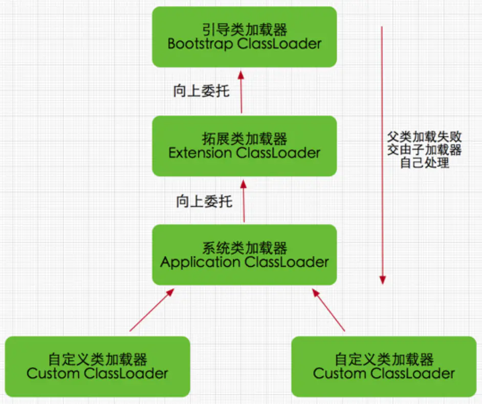

## 1、JVM运行数据区

​		

​		带有Thread标记的为线程私有，其他为公有。也就是说**PC Register（寄存器）、JVM Stack（虚拟机栈）、Native Mehtod Stack（本地方法栈，执行native方法）**为线程独有，每个线程都有这个三件套。堆与方法区线程共享。

​		详细了解可以参考：[JVM内存模型（详解） - 知乎 (zhihu.com)](https://zhuanlan.zhihu.com/p/101495810)


## 2、什么是class文件？为什么Java平台无关？Java文件如何变成的对象的？

​		class文件是Java可以运行在不同的操作系统的关键，java文件编译成class文件的过程个人理解就是将文本格式的数据转换成***二进制数据***的形式，但是二进制数据是有Java格式要求的，格式如下图：  

​		 

​		这个是一个人可以看得懂的格式，其中魔数0xCAFEBABE是Java class文件的开头，是必须的，标志着这是一个Java文件，因为还有其他的运行在jvm上面的编程语言（CAFE是Java与咖啡的渊源），其他诸如版本号说明该class文件支持的最低jdk版本，剩下的属性、方法格式都是一些套路，都是***个数或长度+对应属性值***，代表有几个属性、方法，分别在哪里。例如，某个class文件有一个方法，对应应该是1+对应的堆内存中的指针和方法区中相关记录方法名、类名的数据。真正的二进制格式应该是这样的：


​		详细了解可以参考：[(16条消息) Class文件详解_IT_GJW的博客-CSDN博客_class](https://blog.csdn.net/IT_GJW/article/details/80447947)

​		**平台无关**（个人理解）：因为所有的Java文件都会翻译成格式一致的class文件，平台无关的重任就交给了JVM，底层JVM的实现是不同的，因为Linux系统与Windows系统的内核是不一样的，也就是说他们的系统调用不同，指令不同。所以，只需要安装对应平台的JRE（包含JVM），就能运行class文件。

​		Java文件变成对象的过程：.java文件->.class文件->类加载器加载到方法区（二进制数据流）->class数据流解析验证->根据二进制数据流在堆内存开辟空间->对象指针指向开辟的内存->对象的赋值->新对象。

​		其中指针指向堆内存与对象的赋值不是原子操作，即并发的过程会出现问题，具体例子为双重检测锁单例模式下不添加volatile关键字的情况。后面会讲到。

## 3、什么是类加载器？类加载器的loadClass()与Class.forName()方法有什么关系？

​		类加载器负责将class文件加载到内存（个人理解为Method Area中），因此我们指定的classpath在这一阶段起作用，让ClassLoader在classpath路径下寻找class文件或者其他资源文件。

# 挖坑!!!

***面试复盘：loadClass()与Class.forName()哪个会执行类的静态区域？还是都会执行？（来自深信服笔试）***

​		当时第一印象好像这两个方法在反射的时候都挺常用的，但是好像又没有区别。虽然知道类的静态区会很早执行，但是会在类的加载的时候执行吗？一下子就懵了。但是突然回想很久之前刚接触Java的时候一个没有解决的问题。在第一次使用jdbc的时候，书上只是简单的给了一行代码***Class.forName("com.mysql.cj.jdbc.driver")***就完事了，这样就可以查询数据，没有这一句就差不了数据库。为什么？返回值呢？？？？？？老师也只说了负责加载jdbc驱动，那他怎么实现的呢，为什么没有返回对象，我怎么操作数据库的？

​		结合问题，事实上，执行了这一行代码后，能进行数据库查询，大概率在静态区。因为这一块在一个对象出现之前就会执行了，而恰好满足Class.forName()没有返回值也一样做了某些动作，使得可以操作数据库。而且所学的没有其他特别之处了，那就基本可以确定Class.forName()执行了静态块。有了这个思路之后，同时再回想起，在利用Java做小游戏项目的时候使用到了类加载器加载配置文件，如果类加载器执行了代码，那加载资源的时候无法执行代码那岂不是会报错。

​		综上，最后得出的结论是Class.forName()会执行静态块，loadClass()则不会。最后笔试完之后，使用了代码测试，结果正确。

***loadClass()与Class.forName()***的关系：个人理解上，感觉这两个方法是一个互相依赖的，首先，代码执行时，会加载jdk的基础核心类，在代码运行过程中，需要用到没有加载的类，一般先去方法区找，也就是通过类似于Class.forName()的方式去方法区找，没找到，证明类还没有加载，就用类加载器去加载，也就是loadClass()方法。同时呢，如果类加载了，则需要通过Class.forName()进行类的解析。

​		***所以，个人理解为，loadClass()对应类的狭义的加载阶段，也就是磁盘上的二进制数据加载到方法区二进制数据流的过程；Class.forName()则对应类的解析与验证过程。其中的解析与验证过程为广义上的解析与验证，并非类加载的详细步骤*，此处应该对应第四点的准备与解析阶段，类加载的详细请看第四点**


## 4、类的加载详细过程


​		**（1）加载**：即class文件变为方法区二进制数据流的过程，加载的class文件可来源于网络、数据库、压缩包等，即将数据从磁盘读取的内存当中的过程。（**磁盘->方法区， loadClass方法对应Loading、Verification阶段**）

​		**（2）验证**：验证加载的class文件是否符合Java文件的class格式要求，因为class文件可能是人为乱写的一串二进制数据，甚至会对jvm损坏。（**仍然在方法区当中，验证阶段结束，生成类对应的Class对象，所以，利用反射获取新对象执行的步骤是（3）（4），除非需要反射的对象还没有被加载过。**）

​		**（3）准备**：为类变量**分配内存并赋默认值**，被static final修饰的静态变量在此阶段必须完成赋值，因为被final修饰的变量的值无法修改（**如果是对象，则对象的指针无法修改，对象的内容可以修改**）像boolean默认值为false，int默认值为0，都在此阶段赋默认值。（**已经开始到堆内存了**）

​		**（4）解析**：指针指向堆内存的对象（与方法一起解析了），例如方法栈中需要用到的对象在堆中是哪个对象，与（3）的区别是多了引用指向堆内存。（**堆内存中**）


​															准备所作的工作是开辟空间与赋默认值，解析所作的工作是如何引用第三步创建出来的实例对象

​		**（5）初始化**：此前所作的所有动作，都是靠虚拟机自动完成的，初始化程序员写的代码才起作用，也就是程序员的手动赋值的过程才起作用。但是这里包括两个阶段，**先是静态区域的执行，然后才是构造方法的相关执行**。静态区域包括，static静态块与静态变量的执行，已经赋初始值的会被覆盖掉，但是**被final修饰**的就不会覆盖。然后执行非静态块，以及非静态变量的赋值（覆盖之前的），最后才是构造函数。其中执行静态块或者非静态块的过程中使用到了**父类或接口**，就会先去加载父类，然后按照上面（1）-（5）的顺序执行一遍。

​		**（7）卸载**：参考：[(16条消息) java类卸载机制_一文读懂Java中类的卸载机制_weixin_39886238的博客-CSDN博客](https://blog.csdn.net/weixin_39886238/article/details/114708477?utm_medium=distribute.pc_relevant.none-task-blog-2~default~baidujs_title~default-0.no_search_link&spm=1001.2101.3001.4242)

## 5、双亲委派模型是什么？为什么要双亲委派模型？

​		

​		**Bootstrap ClassLoader**:也叫启动类加载器，**是所有类加载器的父加载器，该加载器由c++编写**，负责加载$JAVA_HOME/lib下的或者被-Xbootclasspath参数指定路径下的包，即rt.jar(rt是runtime的缩写，像java.util.\*、java.lang.\*等包都是在该jar包里面)、tools.jar等jdk核心包。这个类加载器具有加载类的最高优先权。但是并非所有在在上述路径下的包都会加载，JVM会识别符合的jar包才加载。

​		**Extension ClassLoader**：拓展类加载器，负责加载$JAVA_HOME/lib/ext目录下或者java.ext.dirs环境变量指定路径下的jar包，也就是如果每次开发项目都要使用到某个jar包，可以将其放到该目录下。学习过程中没有使用过这个。

​		**Application ClassLoader**：应用程序加载类（上图中为系统类加载器），负责加载classpath路径下的jar包和class文件，我们平时所写的代码就由该类加载器加载。

​		**自定义类加载器**：用户自定义的类加载器。

​		**步骤**：

- ​			如果自定义了类加载器，自定义类加载器加载类时，先由Application ClassLoader类去加载该类，看看是否在该类加载器的加载范围，如果没有自定义类加载器，则由Application类加载器开始。如果Application ClassLoader类加载失败，则由自定义ClassLoader加载。如果Application ClassLoder加载成功，则自定义类加载器不加载。
- Application ClassLoader先让Extension ClassLoader加载，如果Extension ClassLoader加载失败，则由Application ClassLoader加载，如果成功Application ClassLoader则不加载
- Extension ClassLoader先让Bootstrap ClassLoader加载，Bootstrap ClassLoader加载失败，则由Extension ClassLoader加载，如果成功，则Extension ClassLoader不加载。

***就这样，先让父加载器先加载，父加载器加载失败后，才由当前加载器加载，有一种递归的感觉，如果所有加载器都加载失败，则报错！***

```java
public class MyClass{
    Integer i = new Integer();
}
```

当没有实现类加载器加载上面那个类的时候：

1. 先由Application ClassLoader加载，按照Application ClassLoader->Extension ClassLoader->Bootstrap ClassLoder->Extension ClassLoader->Application ClassLoader的顺序加载MyClass类，最后所有父加载器都加载失败，因为不在他们负责的范围内，最后由Application ClassLoader加载。
2. 在解析MyClass的时候，发现MyClass使用到了Integer类，于是按照Application ClassLoader->Extension ClassLoader->Bootstrap ClassLoder的顺序加载Integer类，Integer类在Bootstrap ClassLoader的加载范围，则由Bootstrap ClassLoader加载Integer类，子加载器则不加载。
3. 加载结束。

## 为什么需要双亲委派？

假设在自己的项目中，有人写了以下代码：

```java
package java.lang;

public class Integer{
    
}
```

没错，该类的全类名跟jdk的Integer类全类名完全想同，那如果用全类名反射获取新的Integer对象的时候，应该加载哪个类呢？用户自定义了很多的自定义类加载器，同时该项目因为是多人合作，不知道其他组的人也自定义了加载类，又由谁去加载呢？**不同类加载器是可以加载同一个类的，即A类加载器可以加载MyClass类，B类加载器也可以加载MyClass，互不干扰的。**

如果加载了项目中的那个Integer，那所有使用到Integer类的类，岂不是完全没作用了？！！因为上面那个Integer啥都没干啊，起不到作用。

这时，双亲委派的作用就体现了！！！

1. Application ClassLoader想加载java.lang.Integer类，但是他不能先加载，它要先让父加载器加载。
2. 然后到了Bootstrap ClassLoader，发现java.lang.Integer在自己的加载范围，并且Bootstrap ClassLoader只会识别rt.jar包里面的Integer类，所以直接加载rt.jar包的Integer。
3. Application ClassLoader就不能加载那个空白的Integer类了。解决了安全问题。

**验证**：

定义如下两个java文件:

Integer.java

```java
package Java.lang;

public class Integer{
    static{
        System.out.println("加载自定义Integer类！");
    }
}
```

Main.java

```java
public class Main{
    public static void main(String[] args){
        try {
			Class.forName("java.lang.Integer");
		} catch (ClassNotFoundException e) {
			// TODO Auto-generated catch block
			e.printStackTrace();
		}
    	
    	System.out.println("finish!");
    }
}
```

输出结果：

```java
finish！
```

证明并没有加载自定义的Integer类。

